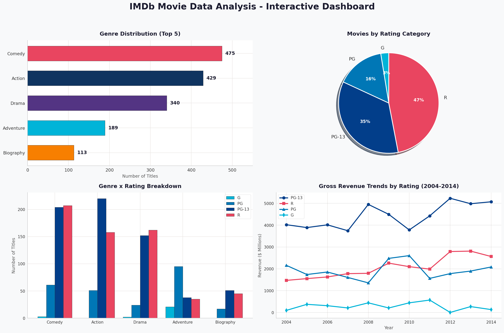

<h1 align="center">:clapper: IMDb Movie Data Analysis :bar_chart:</h1>

<p align="center">
  
  
  
  
</p>

<p align="center">
  <b>An end-to-end Exploratory Data Analysis of 3,733 IMDb movies spanning nearly a century -- uncovering what makes a movie financially successful using only Microsoft Excel.</b>
</p>

---

## :movie_camera: Project Overview

Ever wondered what separates a blockbuster from a box-office flop? This project dives deep into **3,733 movies** from IMDb to analyze the relationships between **genre, ratings, budget, revenue, and profitability** -- all built from scratch in Microsoft Excel.

From raw data to an interactive dashboard, every step of the analysis pipeline is documented and reproducible.

---

## :control_knobs: Dashboard

<p align="center">
  
</p>

---

## :open_file_folder: Dataset at a Glance

| :pushpin: Detail | :chart_with_upwards_trend: Value |
|---|---|
| **Total Movies** | 3,733 |
| **Time Period** | 1920 - 2016 |
| **Attributes** | 18 columns |
| **Top Genre** | Comedy (1,018 movies) |
| **Top Country** | USA (2,949 movies) |
| **Avg IMDb Score** | 6.46 / 10 |
| **Avg Budget** | $44.2 Million |
| **Avg Revenue** | $49.6 Million |

### :page_facing_up: Columns in the Dataset

| :label: Category | :pencil: Fields |
|---|---|
| Movie Info | Title, Release Date, Genre, Duration, Color/B&W |
| People | Lead Actor, Director Name |
| Ratings | IMDb Score (1-10), Rating (R, PG-13, PG, etc.), Total Reviews |
| Financials | Budget, Gross Revenue |
| Social Media | Lead Actor FB Likes, Cast FB Likes, Director FB Likes, Movie FB Likes |
| Geography | Country, Language |

---

## :fire: Key Findings

:small_orange_diamond: **Comedy** dominates production with **1,018 movies**, followed by Action (900) and Drama (674)

:small_orange_diamond: **USA** leads with **79%** of all movies in the dataset (2,949 out of 3,733)

:small_orange_diamond: Average IMDb Score across all movies is **6.46/10** -- most movies score between 5.9 and 7.2

:small_orange_diamond: Average budget is **$44.2M** but average gross revenue is **$49.6M** -- indicating overall profitability

:small_orange_diamond: Custom metrics like **Profit**, **Profit Margin (%)**, and **ROI (%)** reveal which genres truly deliver the best returns

:small_orange_diamond: Identified the **highest-grossing** and **most profitable** movies across all genres

---

## :file_folder: Project Structure

Each file represents a step in the analysis pipeline:

| # | File | What It Contains |
|---|---|---|
| 8 | `8_Raw_Data.xlsx` | Original unprocessed IMDb dataset |
| 7 | `7_Clean, Structured data.xlsx` | Cleaned data -- removed duplicates, fixed formatting, handled missing values |
| 6 | `6_Sorting,Filtering & Grouping Data.xlsx` | Data grouped by release year, country, genre, and rating |
| 5 | `5_Calculated_Fields _ Metrics.xlsx` | New columns: Profit, Profit Margin (%), ROI (%), Total Social Likes |
| 4 | `4_Pivot_Tables.xlsx` | 5 pivot tables -- Revenue by Genre x Rating, Budget by Country, and more |
| 3 | `3_Pivot_Charts.xlsx` | 3 pivot charts -- genre distribution, revenue trends, quarterly patterns |
| 2 | `2_Interactive_dashboard.xlsx` | Interactive dashboard with Slicers and Timelines |
| 1 | `1_Project_Summary.xlsx` | Project overview, methodology, insights, and conclusions |

---

## :arrows_counterclockwise: Analysis Workflow

```
Step 1: Raw Data (3,733 movies, 18 columns)
         |
Step 2: Data Cleaning & Structuring
         |
Step 3: Sorting, Filtering & Grouping
         |
Step 4: Calculated Fields (Profit, ROI, Profit Margin)
         |
Step 5: Pivot Tables (5 summary tables)
         |
Step 6: Pivot Charts (3 visualizations)
         |
Step 7: Interactive Dashboard (Slicers & Timelines)
         |
Step 8: Project Summary & Insights
```

---

## :hammer_and_wrench: Tools and Techniques

| Technique | How It Was Used |
|---|---|
| **Data Cleaning** | Removed duplicates, handled missing values, standardized date and currency formats |
| **Calculated Fields** | Profit = Revenue - Budget, ROI (%), Profit Margin (%), Total Social Media Likes |
| **Pivot Tables** | Cross-tabulated Revenue by Genre x Rating, Budget by Country, Revenue by Director |
| **Pivot Charts** | Bar charts and column charts for genre distribution and revenue trends |
| **Slicers & Timelines** | Interactive filters for Genre, Rating, Country, and Release Year |
| **Conditional Formatting** | Visual indicators for profitability and score ranges |

---

## :rocket: How to Explore

1. :arrow_down: **Download** this repository
2. Open files from `8` (raw data) to `1` (summary) to follow the pipeline
3. Open `2_Interactive_dashboard.xlsx` and use **Slicers** to explore:
   - Which genres generate the most revenue?
   - How do R-rated vs PG-13 movies compare in profitability?
   - What are the revenue trends across decades?
4. Check `1_Project_Summary.xlsx` for final takeaways

> :bulb: **Tip:** Best viewed in **Microsoft Excel 2016 or later** for full slicer and timeline interactivity.

---

## :dart: Conclusion

This analysis provides **data-driven insights** that can inform decision-making in movie production, marketing, and distribution. It demonstrates proficiency in end-to-end data analysis and storytelling through data visualization -- all within Microsoft Excel.

---

## :handshake: Author

<p align="center">
  <b>Nikita Dongre</b><br>
  <i>Data Enthusiast | Excel Analytics | Aspiring Data Analyst</i>
</p>

<p align="center">
  :star: If you found this project useful, give it a star!
</p>

---

<p align="center">
  Made with :heart: and Microsoft Excel
</p>
